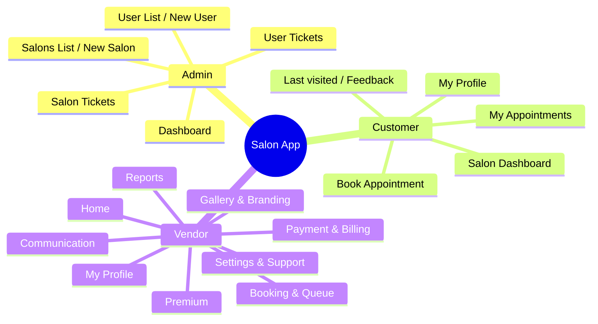

# Salon App – Project Mind Map & Reference

> **Source:** Plan from `SalonApp_Details.txt`  
> **Use:** Refer to this document for project scope, structure, and implementation status.

---

## 1. High-Level Mind Map

```
Salon App
├── Admin Module (Django admin / superadmin)
│   ├── Dashboard (welcome + 4 chart placeholders)
│   ├── Salons List (table: name, owner, mobile, pincode, DoJ, plan, dates, price)
│   ├── New Salon (form)
│   ├── User List (table: same fields)
│   ├── New User (form)
│   ├── Salon Tickets (list + detail: reply, status New/Active/Closed)
│   └── User Tickets (list + detail: reply, status New/Active/Closed)
│
├── User / Customer Module
│   ├── My Profile
│   ├── Book an Appointment
│   ├── Salon Dashboard (welcome)
│   └── My Appointments
│   ├── Welcome: "Welcome Mr/Ms {Name}"
│   ├── Last visited: "Last time you visited XX Salon on DATE"
│   ├── Upcoming / historical appointments (sort by date)
│   ├── Book: salon dropdown → description, address, slots, queue, services, prices, rating, feedback
│   ├── Add to live queue OR future appointment, select services, expected bill
│   └── My Appointments: table, cancel/reschedule, feedback (stars 1–5) for past attended
│
└── Vendor Module
    ├── 0. Home (welcome + 4 chart placeholders)
    ├── 1. Booking & Queue Management
    │   ├── Live Queue Monitoring (customer, services, time, status: Waiting/WIP/Done)
    │   ├── Auto-reminder (morning + 1 hr before appointment)
    │   └── Walk-in Check-ins (name, mobile, services → live queue + history)
    ├── 2. Payment & Billing
    │   ├── Payment Mode (UPI/Card/Cash, QR for online, popup bill to customer)
    │   └── Generate Bill / Invoice (per customer)
    ├── 3. Communication Tools
    │   ├── In-app Chat (placeholder)
    │   ├── Accept / Reschedule / Cancel Appointments
    │   └── Broadcast Offers/Discounts (placeholder)
    ├── 4. Reports
    │   ├── Customer Ratings & Feedback (overall + per customer)
    │   ├── Frequent Customers (visits, earnings)
    │   └── Earnings Summary (Daily/Weekly/Monthly filter)
    ├── 5. Gallery & Branding
    │   ├── Upload/Edit Portfolio (max images by plan)
    │   └── Share on Social (Insta, Facebook, Twitter, YouTube)
    ├── 6. Premium Controls (for paid users)
    ├── 7. Settings & Support
    │   ├── Language Preferences
    │   ├── Contact Support (topics, text, historic complaints table)
    │   └── FAQs / Help
    └── 8. My Profile
        ├── Business Registration & Verification (uploads)
        ├── Add/Remove/Edit Services & Pricing ✅
        ├── Set Slot Availability (working hours, slots open→close-1hr)
        ├── Limit bookings (max per day, 0 = no limit)
        ├── Upload/Edit Profile & Cover
        ├── Staff Management
        └── Create Discounts (placeholder)
```

---

## 2. Current App Structure (Codebase)

| App         | Purpose                          | Key models / logic                    |
|------------|-----------------------------------|--------------------------------------|
| **accounts** | Auth + roles (Admin/Customer/Vendor) | `User` (role, mobile, pincode)       |
| **salons**   | Salon & vendor core               | `Salon` (owner, hours, break, slot_duration, max_capacity) |
| **services** | Services, pricing, slots          | `Service` (salon, name, price, duration); `slot_utils`    |
| **bookings** | Appointments + queue (future)     | `Appointment` (user, salon, date, slot_start, services M2M, status, total_amount) |
| **dashboards** | Customer & vendor UI + routing  | `vendor_required`, `customer_required`; vendor/customer views & URLs |

**Not yet in codebase (from plan):** `payments`, `tickets`, `reports`, `notifications`, `gallery`.

---

## 3. Data Models (Current)

- **User** (accounts): username, role (ADMIN/CUSTOMER/VENDOR), mobile, pincode, first_name, last_name, etc.
- **Salon**: name, owner (FK User), mobile, pincode, opening_time, closing_time, break_start/end, slot_duration, max_capacity_per_slot, is_active.
- **Service**: salon (FK), name, price, duration (min), is_active.
- **Appointment**: user, salon, services (M2M), appointment_date, slot_start, status (BOOKED/CANCELLED/COMPLETED), total_amount, created_at.  
  - `total_amount` kept in sync via signal on `services` M2M.

---

## 4. URL Map (Current)

| Path prefix   | App / module   | Notes                                      |
|---------------|----------------|--------------------------------------------|
| `/admin/`     | Django admin   | Superuser only                              |
| `/login/`, `/logout/` | accounts | Role-based redirect: Vendor → `/vendor/`, Customer → `/customer/` |
| `/vendor/`    | dashboards     | Vendor dashboard, services CRUD + toggle   |
| `/customer/`  | dashboards     | Customer dashboard, book appointment, slots API |

**Vendor:** `vendor_dashboard`, `vendor_services`, `vendor_service_create/update/delete/toggle`.  
**Customer:** `customer_dashboard`, `customer_book_appointment`, `customer_slots_api` (JSON).

---

## 5. Implementation Status vs Plan

### Admin Module
- **Status:** Not implemented in custom app; use Django admin only.
- **Gap:** Custom “Admin Module” UI (dashboard, salons list, new salon, user list, new user, salon/user tickets) as per plan not built.

### Customer Module
- **Done:** Login, customer dashboard (welcome + link to book), Book Appointment (single salon for now, date + slot, slot API), redirect after book.
- **Gap:** My Profile, salon dropdown on book, last-visited salon, services selection + expected bill, My Appointments list, cancel/reschedule, feedback (stars), live queue.

### Vendor Module
- **Done:** Vendor dashboard (sidebar with placeholders), Services (Add/Edit/Delete/Toggle, filter by salon).
- **Gap:** Home charts, Booking & Queue (live queue, reminders, walk-in), Payment & Billing, Communication, Reports, Gallery, Premium, Settings & Support, My Profile (slot availability, limit bookings, staff, discounts, etc.).

### Cross-cutting
- **Done:** Slot generation with break support, slot availability (capacity), `book_appointment` service (no services M2M in flow yet).
- **Gap:** Payments, tickets, reports, notifications, gallery, media uploads, plans/pricing (DoJ, Plan, Plan Start/Expiry, Price).

---

## 6. Key Files Quick Reference

| Area           | Files |
|----------------|--------|
| Auth           | `accounts/views.py`, `accounts/urls.py`, `accounts/models.py` |
| Roles          | `dashboards/decorators.py` (`vendor_required`, `customer_required`) |
| Salons         | `salons/models.py` |
| Services       | `services/models.py`, `services/slot_utils.py` |
| Bookings       | `bookings/models.py`, `bookings/views.py`, `bookings/services.py`, `bookings/signals.py` |
| Dashboards     | `dashboards/views.py`, `dashboards/vendor_urls.py`, `dashboards/customer_urls.py` |
| Templates      | `templates/accounts/login.html`, `templates/customer/dashboard.html`, `templates/customer/book.html`, `templates/vendor/dashboard.html`, `templates/vendor/services.html` |
| Config         | `saloonApp/settings.py`, `saloonApp/urls.py` |

---

## 7. Mermaid Diagram (Optional – for docs that render Mermaid)



---

*Last updated from project review. Use this file with `SalonApp_Details.txt` for full plan vs implementation.*
